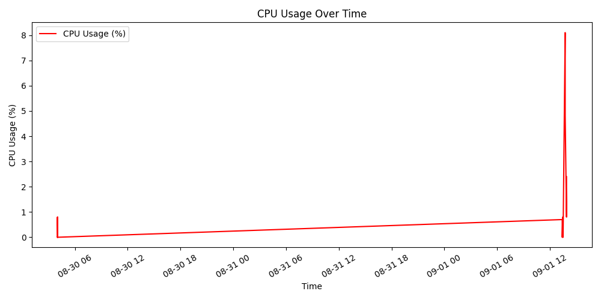
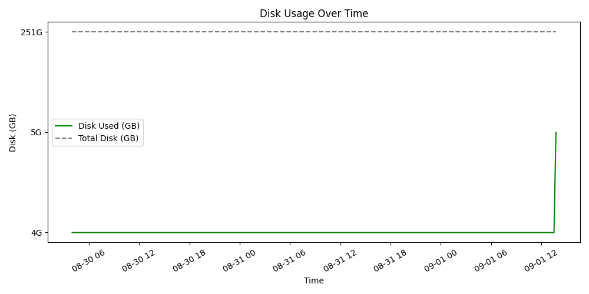
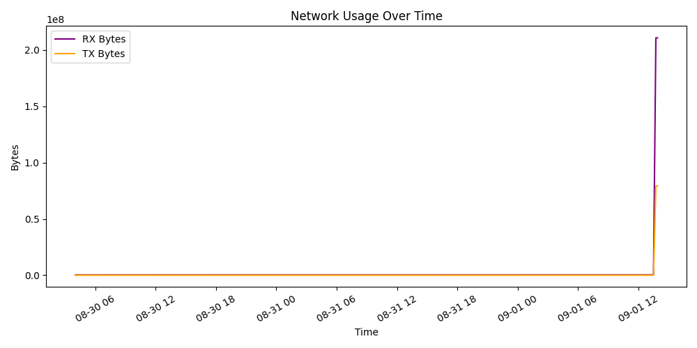

# 🖥️ Linux System Monitor (Bash Script)

A lightweight **system monitoring tool** written in **pure Bash**.  
It displays real-time **CPU, memory, disk, uptime, top processes, and network usage** in your terminal.  

---

## ✨ Features
- ✅ CPU usage with **colored alerts** (Green/Yellow/Red).  
- ✅ Memory usage in **MB** (Used, Free, Total).  
- ✅ Disk usage with total/used/free space.  
- ✅ System uptime.  
- ✅ Top 5 processes by **CPU** and **Memory**.  
- ✅ Network statistics (**RX/TX bytes**) for `eth0`.  
- ✅ Auto-refresh every 4 seconds.  
- ✅ Quit anytime with `q`.  

---

## 🖼️ Demo
Here is a screenshot of the system monitor in action:







---

## 📦 Installation

Clone this repository:
```bash
git clone https://github.com/SakshamKumarGarg/Linux-System-Monitor.git
cd Linux-System-Monitor

