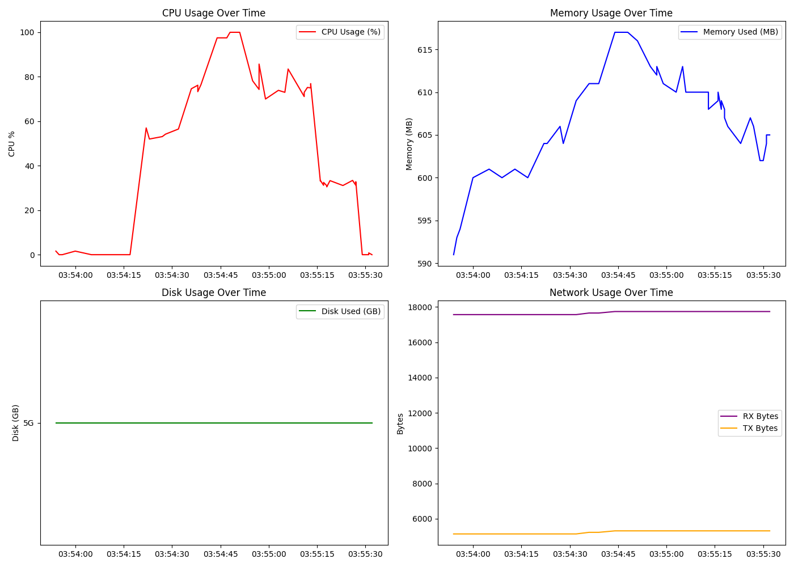

# 🖥️ Linux System Monitor (Bash Script)

A simple yet powerful **Bash-based system monitor** that tracks CPU, memory, disk, and network usage in real-time.  
It logs all collected stats into a CSV file (`sysmon_report.csv`) for later analysis and visualization.  

---

## 📌 Features
- ✅ **CPU Monitoring**
  - Color-coded CPU usage (Green <50%, Yellow <80%, Red >80%)
  - Warning message when CPU usage is critically high
- ✅ **Memory Monitoring**
  - Displays used, total, and free memory (in MB)
  - Warns when memory usage exceeds 80%
- ✅ **Disk Usage**
  - Shows used, total, and available space (root `/` partition)
- ✅ **Uptime**
  - Displays system uptime in human-readable format
- ✅ **Top 5 Processes**
  - By **CPU usage**
  - By **Memory usage**
- ✅ **Network Statistics**
  - Tracks RX (received) and TX (transmitted) bytes for `eth0`
- ✅ **CSV Logging**
  - Logs all stats with timestamp into `sysmon_report.csv`
- ✅ **User-Friendly**
  - Refreshes every 4 seconds
  - Quit anytime with `q + Enter`
- ✅ **Visualization (Python)**
  - Generates time-series plots of CPU, Memory, Disk, and Network usage

---

## 📂 Project Structure
Linux-System-Monitor/
│── sysmon.sh # Main Bash script
│── sysmon_report.csv # Auto-generated system stats log
│── analyze_sysmon.py # Python script for plotting CSV data
└── README.md # Documentation

---

## 🖼️ Demo
Here is a screenshot of the system monitor in action:




---

## 🛠️ Requirements
- Linux (tested on Ubuntu 22.04+)
- Bash shell
- Python 3.8+
- pandas
- matplotlib

## 📦 Installation

Clone this repository:
```bash
git clone https://github.com/SakshamKumarGarg/Linux-System-Monitor.git
cd Linux-System-Monitor

